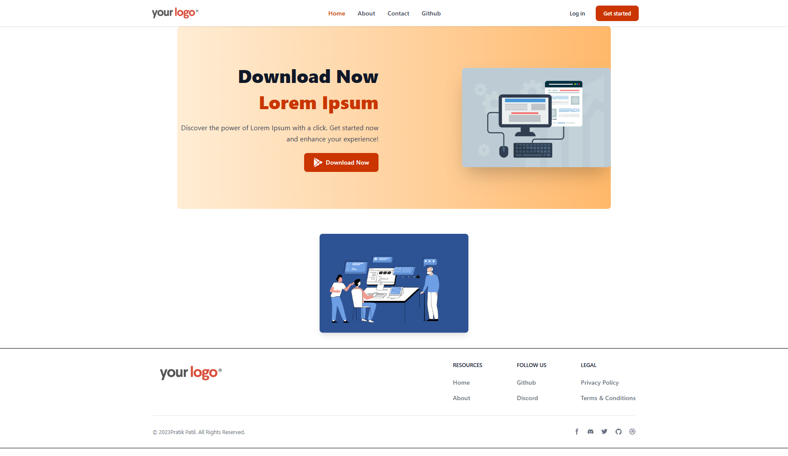
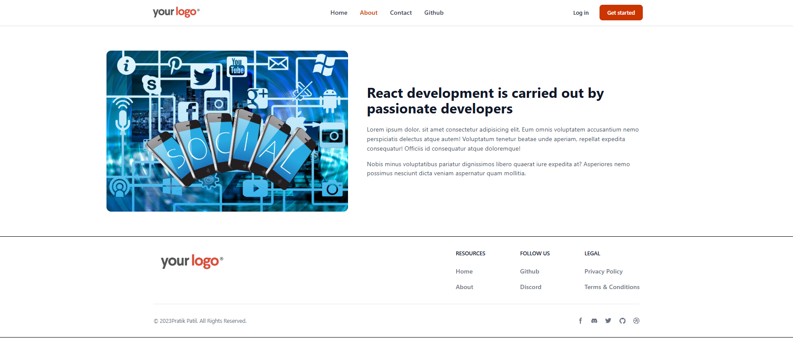
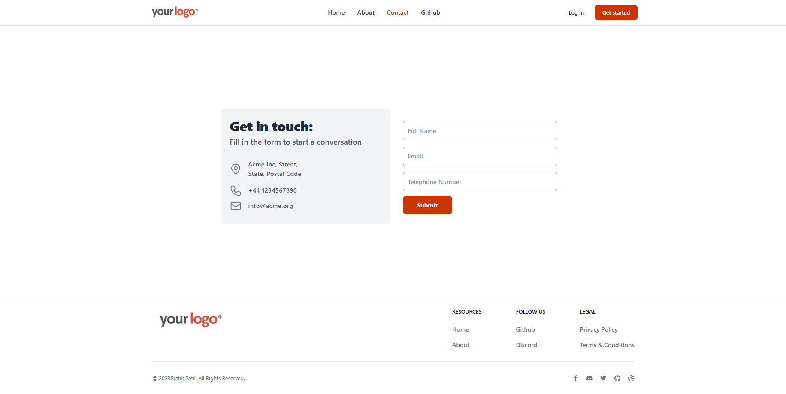
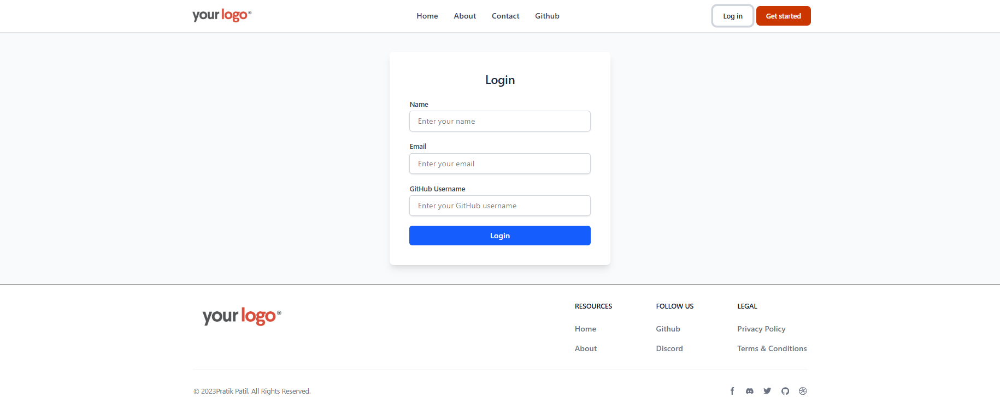
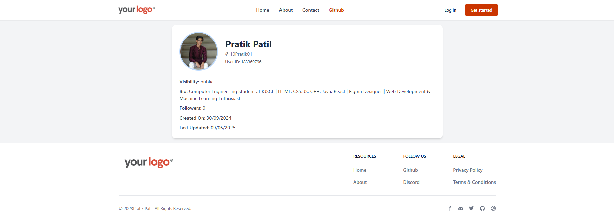

# Modern React Website

A responsive, single-page web application built using React, Vite, React Router DOM, and TailwindCSS. This project serves as a multipage layout for a modern website with reusable components and clean routing.

## 🚀 Features
1. Fully Responsive Design using TailwindCSS  
2. Single Page Application (SPA) with smooth routing  
3. Component-based Architecture  
4. Optimized Build and Fast Refresh via Vite  

## 🛠️ Tech Stack
1. Frontend: React, JSX, TailwindCSS  
2. Routing: React Router DOM  
3. Tooling: Vite, ESLint  

## 📸 Screenshots

### 🏠 Home Page

### ℹ️ About Page

### 📬 Contact Page

### 🔐 Login Page

### 💻 GitHub Section

## 📁 Project Structure

ModernWebsite/  
├── public/  
│   ├── About.png  
│   ├── Contact.png  
│   ├── Github.png  
│   ├── HomePage.png  
│   ├── login.png  
│   └── vite.svg  
├── src/  
│   ├── Layout/  
│   │   └── Layout.jsx              # Common layout wrapper  
│   ├── assets/                    # Static assets (images)  
│   │   ├── about_img.jpg  
│   │   ├── home_img1.jpg  
│   │   └── home_img2.png  
│   ├── components/  
│   │   ├── About/                 # About page  
│   │   │   └── About.jsx  
│   │   ├── Contact/               # Contact page  
│   │   ├── Footer/                # Footer component  
│   │   ├── Github/                # GitHub-related section  
│   │   ├── Header/                # Header/navigation bar  
│   │   ├── Home/                  # Home page  
│   │   ├── LoginPage/             # Login functionality  
│   │   ├── PrivacyPolicy/         # Privacy Policy page  
│   │   ├── TermsAndConditions/    # Terms and Conditions page  
│   │   └── User/                  # User-specific page/section  
│   ├── App.jsx                    # Main app with routes  
│   ├── index.js                   # Entry point  
│   ├── index.css                  # Global styles  
│   └── main.jsx                   # Renders the App  
├── .gitignore  
├── README.md  
├── eslint.config.js  
├── index.html  
├── package.json  
├── package-lock.json  
└── vite.config.js  

## 📦 Getting Started

### Prerequisites
- Node.js (v14 or later)  
- npm or yarn  

### Installation
1. Clone the repository  
   git clone https://github.com/yourusername/your-repo.git  
   cd your-repo  

2. Install dependencies  
   npm install  

3. Start the development server  
   npm run dev  

## 📜 Scripts
- npm run dev – Launch development server  
- npm run build – Build for production  
- npm run preview – Preview production build locally  

